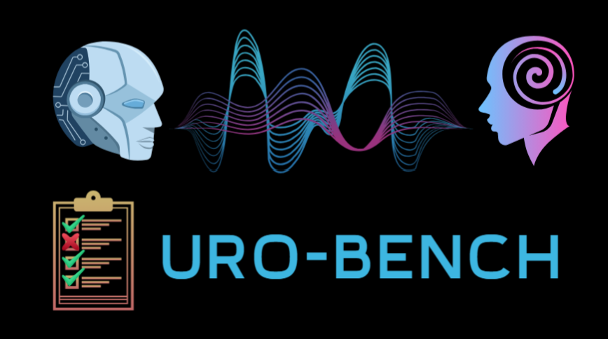
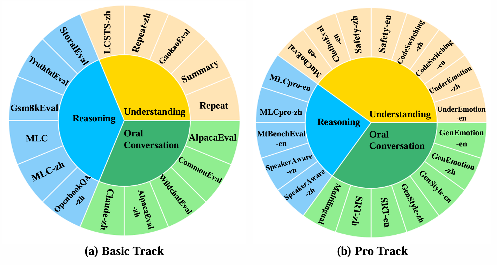
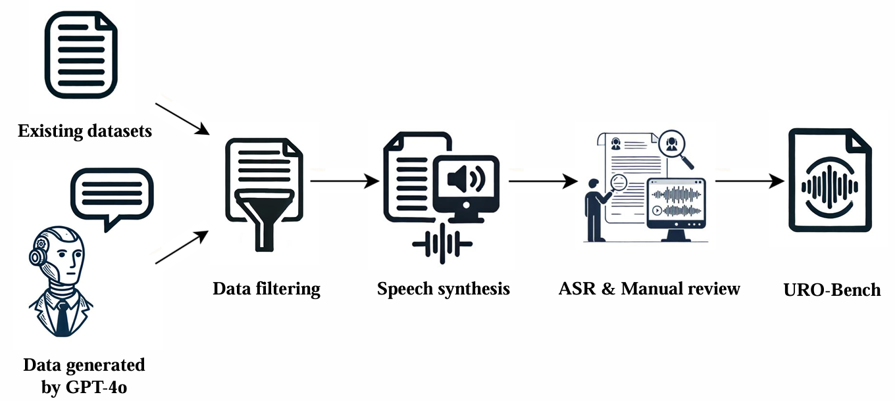
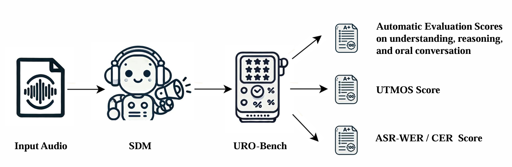

<div align="center">
    <h1>
    URO-Bench
    </h1>
    <p>
    Official code for evaluating spoken dialogue models with <br>
    <b><em>URO-Bench: A Comprehensive Benchmark for End-to-End Spoken Dialogue Models</em></b>
    </p>
    <p>
    
    </p>
    <p>
    </p>
    <a href="https://github.com/Ruiqi-Yan/URO-Bench"></a>
    <a href="https://github.com/Ruiqi-Yan/URO-Bench"></a>
    <a href="https://huggingface.co/datasets/Honggao/URO-Bench"></a>
    <a href="https://github.com/Ruiqi-Yan/URO-Bench"></a>
</div>


## News
- [Update Feb. 25, 2025] 🔥🔥🔥 code and data of URO-Bench have been released!


## Overview
This repo contains the code of [URO-Bench: A Comprehensive Benchmark for End-to-End Spoken Dialogue Models](https://arxiv.org/abs/2502.17810).

<table align="center">
  <tr>
    <td align="center"></td>
  </tr>
</table>

In recent years, end-to-end spoken dialogue models (SDMs) have made significant strides. Compared to text-based LLMs, the evaluation of SDMs needs to take **speech-related aspects** into account, such as paralinguistic information and speech quality. However, there is still a lack of comprehensive evaluations for SDMs in speech-to-speech (S2S) scenarios.  
To address this gap, we propose **URO-Bench**, an extensive benchmark for SDMs. Notably, URO-Bench is the first S2S benchmark that covers evaluations about **multilingualism**, **multi-round dialogues**, and **paralinguistics**. Our benchmark is divided into two difficulty levels: basic track and pro track, consisting of 16 and 20 datasets respectively, evaluating the model's abilities in **U**nderstanding, **R**easoning, and **O**ral conversation. We hope that URO-Bench can effectively facilitate the development of spoken dialogue models by providing a multifaceted evaluation of existing models and helping to track progress in this area.

<table align="center">
  <tr>
    <td align="center"><b>Construction of URO-Bench</b><br></td>
  </tr>
  <tr>
    <td align="center"><b>Evaluation of SDM on URO-Bench</b><br></td>
  </tr>
</table>


### Contents
1. [Datasets](#datasets)
2. [Evaluation](#evaluation)
3. [Leaderboard](#leaderboard)
4. [Acknowledge](#acknowledge)
5. [Citation](#citation)


## Datasets
Currently, we support **36** datasets, including **20** different tasks, available at [URO-Bench](https://huggingface.co/datasets/Honggao/URO-Bench).  
The test sets are divided into 2 tracks, basic and pro.

| Subset          | Track | Lang | # Samples |     Task Type                         |
|:---------------:|:-----:|:----:|:---------:|:-------------------------------------:|
| AlpacaEval      | basic | en   |    199    |     Open-Ended QA                     |
| CommonEval      | basic | en   |    200    |     Open-Ended QA                     |
| WildchatEval    | basic | en   |    349    |     Open-Ended QA                     |
| StoralEval      | basic | en   |    201    |     Moral concluding                  |
| Summary         | basic | en   |    118    |     Summarizing                       |
| TruthfulEval    | basic | en   |    470    |     Fact QA                           |
| GaokaoEval      | basic | en   |    303    |     English listening exam            |
| Gsm8kEval       | basic | en   |    582    |     Math application problem          |
| MLC             | basic | en   |    177    |     Math, Logic, Commen sense         |
| Repeat          | basic | en   |    252    |     Repeat                            |
| AlpacaEval-zh   | basic | zh   |    200    |     Open-Ended QA                     |
| Claude-zh       | basic | zh   |    273    |     Open-Ended QA                     |
| LCSTS-zh        | basic | zh   |    229    |     Summarizing                       |
| MLC-zh          | basic | zh   |    136    |     Math, Logic, Commen sense         |
| OpenbookQA-zh   | basic | zh   |    257    |     Single-choice QA                  |
| Repeat-zh       | basic | zh   |    210    |     Repeat                            |
| CodeSwitching-en| pro   | en   |    70     |     Code switching QA                 |
| CodeSwitching-zh| pro   | zh   |    70     |     Code switching QA                 |
| GenEmotion-en   | pro   | en   |    54     |     Speech emotion generation         |
| GenEmotion-zh   | pro   | zh   |    43     |     Speech emotion generation         |
| GenStyle-en     | pro   | en   |    44     |     Speech style generation           |
| GenStyle-zh     | pro   | zh   |    39     |     Speech style generation           |
| MLCpro-en       | pro   | en   |    91     |     Math, Logic, Commen sense         |
| MLCpro-zh       | pro   | zh   |    64     |     Math, Logic, Commen sense         |
| Safety-en       | pro   | en   |    24     |     Pravicy-related                   |
| Safety-zh       | pro   | zh   |    20     |     Pravicy-related                   |
| SRT-en          | pro   | en   |    43     |     Singing, Reciting, Tongue twister |
| SRT-zh          | pro   | zh   |    21     |     Singing, Reciting, Tongue twister |
| UnderEmotion-en | pro   | en   |    137    |     Speech emotion understanding      |
| UnderEmotion-zh | pro   | zh   |    79     |     Speech emotion understanding      |
| Multilingual    | pro   | multi|    1108   |     Multilingual QA                   |
| ClothoEval-en   | pro   | en   |    265    |     Audio understanding               |
| MuChoEval-en    | pro   | en   |    311    |     Music understanding               |
| MtBenchEval-en  | pro   | en   |    190    |     Multi-round conversation          |
| SpeakerAware-en | pro   | en   |    55     |     Speaker recognition               |
| SpeakerAware-zh | pro   | zh   |    49     |     Speaker recognition               |


## Evaluation

We provide some examples in folder [examples](examples) and [scripts](scripts).  
We've tried our best to make it easy to use. If you encounter any issues, feel free to contact us through the 'Issues' section.

### Step0: setup

```bash
# get environment ready
git clone https://github.com/Ruiqi-Yan/URO-Bench
cd URO-Bench
conda create -n uro python=3.11
conda activate uro
pip install -r requirements.txt

# get data ready
cd ..
export HF_ENDPOINT=https://hf-mirror.com    # if you have trouble with the network
huggingface-cli download --repo-type dataset --resume-download Honggao/URO-Bench URO-Bench-data.zip --local-dir ./ --local-dir-use-symlinks False
unzip URO-Bench-data.zip
```

### Step1: modify your infer code
You can modify the code based on examples/example-test/[inference_for_eval.py](examples/example-test/inference_for_eval.py).
Just wrap your code inside the `load_sdm` and `respond` functions.

For multi-round dialogue, please refer to examples/example-test/[inference_multi.py](examples/example-test/inference_multi.py). Ensure the output file matches the required format.

### Step2: fill in the bash file
Complete the script based on scripts/[example.sh](scripts/example.sh). You just need to change some of the directories' name and the inference part.

### Step3: run the automatic evaluation pipeline
Run `example.sh` and get the results.  
Remember to fill in your api key in metrics/[mark_gpt.py](metrics/mark_gpt.py).
```bash
bash scripts/example.sh
```


## Leaderboard

The scores of *Whisper-large-v3 + LLMs* are provided as reference.

### Basic track

#### EN
| **Rank** | **Model** | **LLM Scale** | **Repeat↑** | **Summary↑** | **GaokaoEval↑** | **StoralEval↑** | **TruthfulEval↑** | **Gsm8kEval↑** | **MLC↑** | **AlpacaEval↑** | **CommonEval↑** | **WildchatEval↑** | **Avg.UTMOS↑** | **Avg.ASR-WER↓** | **Overall↑** |
|:--------:|:------------:|:---------------:|:---------:|:----------:|:-------------:|:-------------:|:---------------:|:------------:|:------:|:-------------:|:-------------:|:---------------:|:-------------:|:------------------:|:---------------:|
| *-* | *Whisper + GPT-4o* |   *-*    | *95.24* | *96.16* | *86.47* | *86.97* | *78.24* | *90.72* | *75.71* | *98.29* | *89.77* | *95.74* |   *-*    |   *-*    | *89.33* |
| *-* | *Whisper + GLM-4-9B-Chat-HF* |   *-*    | *97.18* | *93.45* | *81.85* | *77.68* | *68.81* | *78.64* | *80.04* | *92.53* | *82.27* | *89.99* |   *-*    |   *-*    | *84.24* |
| *-* | *Whisper + Qwen2-7B-Instruct* |   *-*    | *96.87* | *97.45* | *0.66* | *82.35* | *67.89* | *88.26* | *73.26* | *95.91* | *85.93* | *92.72* |   *-*    |   *-*    | *78.13* |
| *-* | *Whisper + Llama-3.1-8B-Instruct* |   *-*    | *58.41* | *92.32* | *0.33* | *74.10* | *67.42* | *87.29* | *71.75* | *94.47* | *80.73* | *90.96* |   *-*    |   *-*    | *71.78* |
| 1 | GLM-4-Voice |   9B    | **90.95** | **91.07** | **64.47** | **73.80** | **59.28** | **30.93** | **57.82** | **80.77** | **63.07** | **78.76** | 4.15 | 12.71% | **69.09** |
| *-* | *Whisper + Qwen2-0.5B-Instruct* |   *-*    | *60.12* | *78.59* | *0.33* | *49.82* | *39.73* | *35.17* | *52.92* | *58.93* | *57.50* | *63.97* |   *-*    |   *-*    | *49.71* |
| 2 | Freeze-Omni |   7B    | 70.89 | 78.87 | 26.29 | 57.74 | 46.95 | 2.81 | 42.56 | 52.23 | 48.70 | 55.80 | 4.37 | 16.32% | 48.28 |
| 3 | LLaMA-Omni |   8B    | 45.62 | 80.68 | 16.06 | 50.65 | 45.13 | 3.89 | 44.44 | 64.36 | 58.40 | 72.19 | 4.02 | 10.42% | 48.14 |
| 4 | SLAM-Omni  |   0.5B    | 12.26 | 66.21 | 1.32  | 36.95 | 34.65 | 0    | 21.85 | 48.98 | 41.03 | 52.61 | **4.45** | **4.54%** | 31.59 |
| 5 | Mini-Omni2 |   0.5B    | 8.10  | 40.06 | 0.66  | 28.49 | 26.92 | 0    | 6.97  | 34.81 | 30.70 | 36.43 | 4.43 | 10.24% | 21.31 |
| 6 | Mini-Omni  |   0.5B    | 5.07  | 32.20 | 0     | 23.25 | 25.06 | 0    | 2.82  | 30.99 | 29.80 | 31.42 | 4.42 | 6.05% | 18.06 |


#### ZH
| **Rank** | **Model** | **LLM Scale** | **Repeat-zh↑** | **LCSTS-zh↑** | **MLC-zh↑** | **OpenbookQA-zh↑** | **AlpacaEval-zh↑** | **Claude-zh↑** | **Avg.UTMOS↑** | **Avg.ASR-CER↓** | **Overall↑** |
|:--------:|:------------:|:---------------:|:---------:|:----------:|:-------------:|:-------------:|:-------------:|:---------------:|:-------------:|:------------------:|:---------------:|
| *-* | *Whisper + GPT-4o*            | *-* | *63.53*   | *90.80* | *63.73* | *73.54* | *86.80* | *97.36* | *-* | *-* | *79.29* |
| *-* | *Whisper + GLM-4-9b-Chat-HF*   | *-* | *64.86* | *84.45*   | *60.29*   | *59.66*   | *80.17*   | *92.84*   | *-* | *-* | *73.71*   |
| *-* | *Whisper + Qwen2-7B-Instruct*    | *-* | *25.16*   | *90.10*   | *60.78*   | *63.29*   | *85.03*   | *97.09*   | *-* | *-* | *70.24*   |
| 1 | GLM-4-Voice  |   9B    | **79.10** | **77.14** | **46.08** | **49.93** | **69.26** | **84.02** |  3.10  |  **4.54%**  | **67.59** |
| *-* | *Whisper + LLaMA-3.1-8B-Instruct*  | *-* | *14.15*   | *82.18*   | *57.35*   | *57.07*   | *77.63*   | *89.57*   | *-* | *-* | *62.99*   |
| *-* | *Whisper + Qwen2-0.5B-Instruct*   | *-* | *13.68*   | *62.77*   | *33.82*   | *23.09*   | *54.50*   | *69.87*   | *-* | *-* | *42.96*   |
| 2 | Freeze-Omni  |   7B    | 3.66     | 70.33    | 32.43    | 10.89    | 59.40    | 67.76      |  3.60  | 6.36%  | 40.74    |
| 3 | SLAM-Omni    |   0.5B    | 22.02    | 36.97    | 15.88    | 8.17     | 42.53    | 48.40      |  **3.64**  | 5.15%  | 29.00    |


### Pro track

#### EN
| **Rank** | **Model** | **LLM Scale** | **UnderEmotion-en↑** | **CodeSwitching-en↑** | **Safety-en↑** | **ClothoEval-en↑** | **MuChoEval-en↑** | **MLCpro-en↑** | **MtBenchEval-en↑** | **SpeakerAware-en↑** | **SRT-en↑** | **GenEmotion-en↑** | **GenStyle-en↑** | **Multilingual↑** | **Avg.UTMOS↑** | **Avg.ASR-WER↓** | **Overall↑** |
|:--------:|:------------:|:---------------:|:---------:|:----------:|:-------------:|:-------------:|:---------------:|:------------:|:------:|:-------------:|:-------------:|:---------------:|:-------------:|:------------------:|:---------------:|:-------------:|:------------------:|
| 1 | GLM-4-Voice   | 9B | **52.41** | **58.00** | **65.56** | 17.36 | **32.37** | **65.20** | **68.35** | **50.30** | 45.12 | **48.13** | **94.55** | **43.53** | 4.14 | 9.67% | **53.41** |
| 2 | LLaMA-Omni    | 8B | 36.35     | 25.52     | 43.89     | **22.52** | 15.97     | 47.62     | -         | -         | 25.12 | 8.62      | 83.03     | 21.10     | 3.99 | 7.13% | 32.97     |
| 3 | Freeze-Omni   | 7B | 48.27     | 37.90     | 58.06     | 1.51  | 0.32      | 5.49      | -         | -         | **46.98** | 18.92     | 66.36     | 20.42     | 4.30 | 25.94% | 30.42     |
| 4 | SLAM-Omni     | 0.5B | 45.84     | 21.14     | 48.33     | 10.94 | 2.68      | 10.26     | 32.88     | 31.03     | 26.51 | 8.42      | 64.24     | 20.54     | **4.46** | **3.61%** | 26.90     |
| 5 | Mini-Omni2    | 0.5B | 42.53     | 22.00     | 56.94     | 0.38  | 0.32      | 0         | -         | -         | 20.47 | 3.73      | 44.39     | 20.70     | 4.42 | 7.62% | 21.15     |
| 6 | Mini-Omni     | 0.5B | 29.05     | 20.38     | 58.89     | 0     | 0         | 0         | -         | -         | 9.77  | 1.29      | 40.30     | 20.83     | 4.42 | 5.63% | 18.05     |


#### ZH
| **Rank** | **Model** | **LLM Scale** | **UnderEmotion-zh↑** | **CodeSwitching-zh↑** | **Safety-zh↑** | **MLCpro-zh↑** | **SpeakerAware-zh↑** | **SRT-zh↑** | **GenEmotion-zh↑** | **GenStyle-zh↑** | **Avg.UTMOS↑** | **Avg.ASR-CER↓** | **Overall↑** |
|:--------:|:------------:|:---------------:|:---------:|:----------:|:-------------:|:-------------:|:-------------:|:---------------:|:-------------:|:------------------:|:---------------:|:-------------:|:------------------:|
| 1 | GLM-4-Voice   | 9B | **74.51** | **72.00** | **57.67** | **47.40** | **52.52** | **67.62** | **44.79** | **93.85** | 3.27 | **4.05%** | **63.80** |
| 2 | Freeze-Omni   | 7B | 66.08     | 54.67     | 44.00     | 22.40     | -         | 41.90     | 7.83      | 77.78     | 3.67 | 7.46% | 44.95     |
| 3 | SLAM-Omni     | 0.5B | 27.59     | 43.71     | 35.00     | 10.94     | 38.50     | 37.14     | 5.67      | 72.99     | **3.74** | 4.55% | 33.94     |


## Acknowledge
- We borrow some code from [Voicebench](https://github.com/MatthewCYM/VoiceBench), [Whisper](https://github.com/openai/whisper/tree/main/whisper/normalizers), [F5-TTS](https://github.com/SWivid/F5-TTS), [emotion2vec](https://github.com/ddlBoJack/emotion2vec), and [Fairseq](https://github.com/facebookresearch/fairseq).
- The infer code of SDMs were adapted from their original demo code.

## Citation
If you use URO-Bench in your research, please cite the following paper:
```
@article{yan2025uro,
  title={URO-Bench: A Comprehensive Benchmark for End-to-End Spoken Dialogue Models},
  author={Yan, Ruiqi and Li, Xiquan and Chen, Wenxi and Niu, Zhikang and Yang, Chen and Ma, Ziyang and Yu, Kai and Chen, Xie},
  journal={arXiv preprint arXiv:2502.17810},
  year={2025}
}
```
