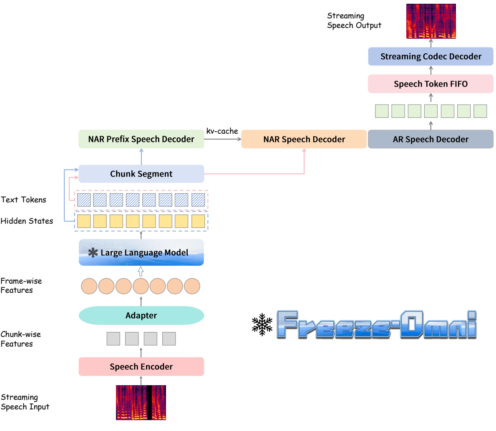
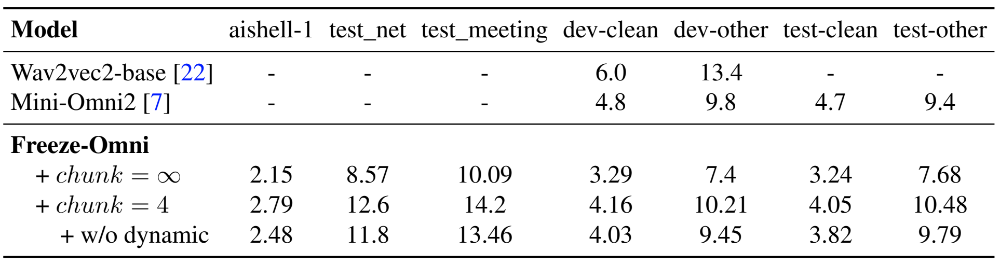
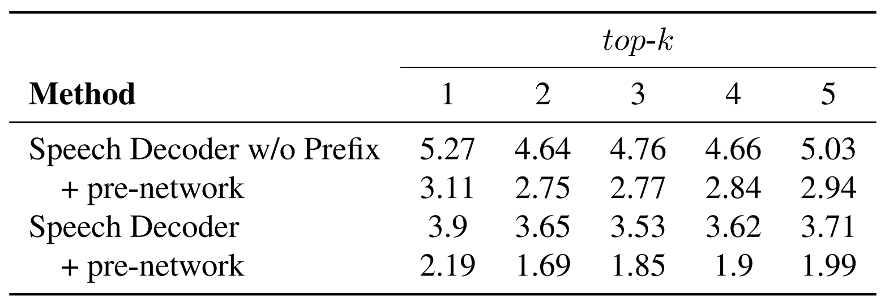
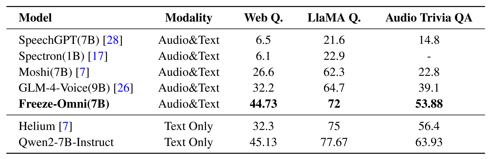
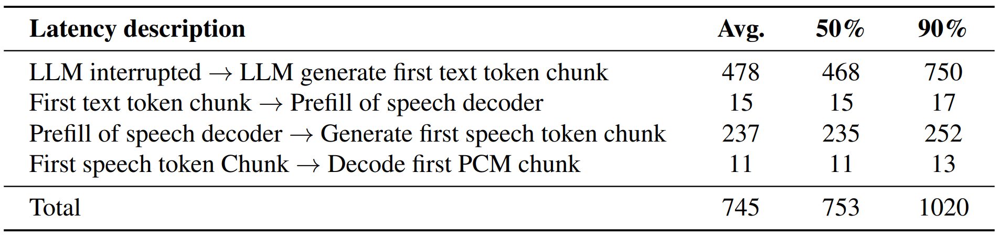

# Freeze-Omni: A Smart and Low Latency Speech-to-speech Dialogue Model with Frozen LLM


<p align="center">
    
</p>

<font size=7><div align='center' > [[🍎 Project(Demo) Page](https://freeze-omni.github.io)] [[📖 arXiv Paper](https://arxiv.org/abs/2411.00774)] [[🤗 Hugging Face](https://huggingface.co/VITA-MLLM/Freeze-Omni)] [[💬 WeChat (微信)](./assets/wechat_code.jpg)]</div></font></div></font>

---

## 🔥 News
* **`2024.11.26`** 🌟 The inference code, server demo and model weights **have been released**. Long wait!
* **`2024.11.4`** 🌟 We are very proud to launch Freeze-Omni, a speech-to-speech dialogue model
with both low-latency and high intelligence! We have submitted the open-source code, yet it is under review internally. We are moving the process forward as quickly as possible, stay tuned!

## Contents <!-- omit in toc -->


- [Freeze-Omni Overview](#-freeze-omni-overview)
- [Experimental Results](#-experimental-results)
- [Inference](#-inference)
  - [Requirements and Installation](#requirements-and-installation)
  - [Quick Start](#quick-start)
  - [Real-Time Interactive Demo](#real-time-interactive-demo)


## 👀 Freeze-Omni Overview
Freeze-Omni is a speech-to-speech dialogue model, exhibiting the characteristic of being "**smart**" as it is constructed upon a "**frozen**" text-modality LLM. This enables it to keep the original intelligence of the LLM backbone, without being affected by the forgetting problem induced by the fine-tuning process for integration of the speech modality. Specifically, Freeze-Omni contains a speech encoder that supports streaming speech input and a speech decoder that generates streaming output speech. **Three key strategies** are adopted to implement the speech-to-speech dialogue system:

- **Chunk-wise Streaming Input**. Freeze-Omni has a speech encoder supporting chunk-wise streaming input speech features to obtain a fast response to input. A 3-stage training strategy can help it keep strong acoustic robustness.

- **AR-base Speech Output**. Freeze-Omni has an AR speech decoder based on a single codebook, which can achieve low-latency speech output in streaming. A prefix tuning method is used so that training on only a small amount of Q&A data can achieve the ability to produce high-quality speech synthesis.

- **Chunk-level State Prediction**. Freeze-Omni adds a classification layer after the last layer of the backbone LLM to predict different states. These states will determine whether or not the user interrupts the dialogue to achieve a duplex dialogue for the user and the bot.

<p align="center">
    
</p>

Besides we implement a Model as a Server strategy. We first started several models simultaneously and regarded them as a server. Then, when a user's VAD was triggered, the speech would be sent to the server in the form of chunks, and the server would be responsible for scheduling which idle model should respond to the current chunk. Since we separated all the kv-cache and CNN cache of the speech encoder and LLM during the inference process, the server only needs to save the inference cache for each user. In this way, any model in the server could respond to any chunk of any user, and there was no need to specify which model was used as a monitor or a generator.


## 📈 Experimental Results
- **Evaluation of speech understanding through ASR tasks, using CER(%) and WER(%).**.

<p align="center">
    
</p>


- **Evaluation of output speech quality on different top-k of AR decoder by using CER(%).**

<p align="center">
    
</p>

- **Evaluation of spoken question answering on accuracy(%).**

<p align="center">
    
</p>

- **Analysis of end-to-end latency for different parts.**

<p align="center">
    
</p>


## 📐 Inference
### Requirements and Installation
**Environment Requirements**: 
```
git clone https://github.com/VITA-MLLM/Freeze-Omni
cd Freeze-Omni
conda create -n freeze-omni python=3.10 -y
conda activate freeze-omni
pip install --upgrade pip
pip install -r requirements.txt
```
**Required weights**: 
- Download [Freeze-Omni checkpoint](https://huggingface.co/VITA-MLLM/Freeze-Omni) then move `checkpoints` into the root dir of this repo (`Freeze-Omni/checkpoints`) 
- Download [Qwen2-7B-Instruct checkpoint](https://huggingface.co/Qwen/Qwen2-7B-Instruct) then move `Qwen2-7B-Instruct` into the root dir of this repo (`Freeze-Omni/Qwen2-7B-Instruct`) 

### Quick Start
**From python command**
```
export PYTHONPATH=./:$PYTHONPATH
CUDA_VISIBLE_DEVICES=0 python3 bin/inference.py \
    --model_path ./checkpoints \
    --input_wav ./assets/question.wav \
    --output_wav ./assets/answer.wav \
    --llm_path ./Qwen2-7B-Instruct \
    --top_p 0.8 \
    --top_k 20 \
    --temperature 0.8
```
**From script**
```
sh scripts/run_inference.sh
```

### Real-Time Interactive Demo

To have a good interactive experience, please pay attention to the following three points:

- **Ensure a high-speed network connection**.
- **Use high-performance GPUs for deployment**. In the demo video, we use 1 Nvidia A100 GPU. A800, H800, or H20 will be much better.
- **Maintain a quiet environment**.

**From python command**
```
export PYTHONPATH=./:$PYTHONPATH
CUDA_VISIBLE_DEVICES=0 python3 bin/server.py \
    --ip your_server_ip \
    --port your_server_port \
    --max_users 3 \
    --llm_exec_nums 1 \
    --timeout 180 \
    --model_path ./checkpoints \
    --llm_path ./Qwen2-7B-Instruct \
    --top_p 0.8 \
    --top_k 20 \
    --temperature 0.8
```
**From script**

Change the **ip** and **port** in `scripts/run_demo_server.sh` with yours and run:
```
sh scripts/run_demo_server.sh
```

## ✒️ Citation

If you find our work helpful for your research, please consider citing our work.   

```bibtex
@article{xiong2024freeze,
  title={Freeze-Omni: A Smart and Low Latency Speech-to-speech Dialogue Model with Frozen LLM},
  author={Xiong Wang and Yangze Li and Chaoyou Fu and Yunhang Shen and Lei Xie and Ke Li and Xing Sun and Long Ma},
  journal={arXiv preprint arXiv:2411.00774},
  year={2024}
}
```

## &#x1F4E3; Statement

**Freeze-Omni is trained on large-scale corpus, and its output has randomness. Any content generated by Freeze-Omni does not represent the views of the model developers. We are not responsible for any problems arising from the use, misuse, and dissemination of Freeze-Omni, including but not limited to public opinion risks and data security issues.**

## 📜 Related Works

Explore our related researches:
-  **[VITA]** [Towards Open-Source Interactive Omni Multimodal LLM](https://github.com/VITA-MLLM/VITA)
-  **[Awesome-MLLM]** [A Survey on Multimodal Large Language Models](https://github.com/BradyFU/Awesome-Multimodal-Large-Language-Models)
-  **[MME]** [MME: A Comprehensive Evaluation Benchmark for Multimodal Large Language Models](https://github.com/BradyFU/Awesome-Multimodal-Large-Language-Models/tree/Evaluation)
-  **[Video-MME]** [Video-MME: The First-Ever Comprehensive Evaluation Benchmark of Multi-modal LLMs in Video Analysis](https://github.com/BradyFU/Video-MME) 

## 👍 Acknowledgement
Freeze-Omni is built with reference to the following outstanding works: [Qwen2-7B-Instruct](https://huggingface.co/Qwen/Qwen2-7B-Instruct), [TiCodec](https://github.com/y-ren16/ticodec)
